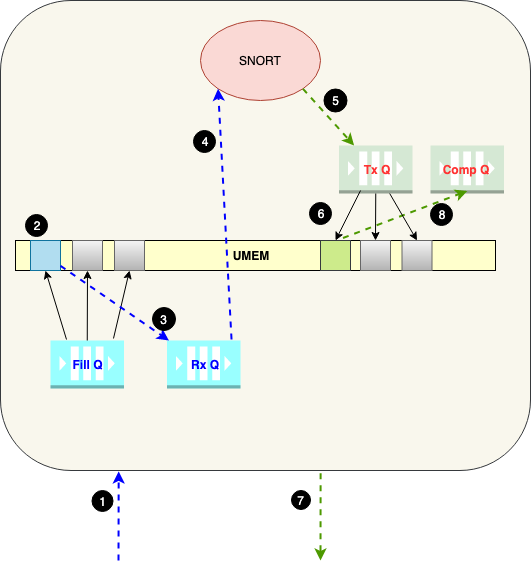

AFXdp Module
===============

A DAQ module built on top of the XDP libbpf library
This interface allows bridged mode using -i ethx:ethy syntax

Concepts
--------
- UMEM is virtual block of memory divied into equale size frames "4K", UMEM can be shared accross multiple sockets
- UMEM Fill Ring is used to transfer ownership of UMEM frames from user-space to kernel-space
- UMEM Completion Ring is used to transfer ownership of UMEM frames from kernel back to user-space for buffers reuse
- RX Ring is the receiving side of XSK socket
- Tx Ring is the sending side of the XSK socket

Initization
-----------
- A flat buffer of equaly chunks "4K" is allocated UMEM
- Populate Fill queue ring's descriptors with allocated UMEM buffers
- Create AFXDP sockets for input and output interface

Packet flow
-----------
  

- receive module will poll input socket FD with configured time out
- once it detects a packet it will check socket's RX queue to findout how many packets it received
- read fill queue descriptors to find out packet length and the buffer in UMEM array where the packet reside
- send the packets to snort for inspection
- snort will invoke Transmit routine one packet at a time
- will poplulate socket Tx queue with packet's length and the buffer in UMEM memort
- issue linux sendto with MSG_DONTWAIT "for performance"
- once completed put the completed discriptor in compelete queue ring
- release rx socket descriptor for reuse

Note: buffer is shared between Rx and Tx "no packet copying"

Requirements
------------
* Linux kernel version 5.3 or higher and libbpf v0.0.6

Experiments with different kernels
----------------------------------
|  Kernel version  | Status |  Error  |
| :--------------: | :----: | :-----: |
|  v5.0.0-1022-gke | Failed | ENOTSUP |
|       v5.1.0     | Failed | ENOTSUP |
|       v5.2.0     | Failed | ENOTSUP |
|       v5.3.0     | Passed |         |
|     v5.4.2       | Passed |         |

Steps :-
- start container with snort3's afxdp daq image
```
    docker run --privileged -it dockerhub.cisco.com/ngvs-docker/snort3afxdp:v1.0 bash
```
- from container's bash start snort3 process with afxdp daq
```
    snort -Q -v --daq afxdp --daq-dir /usr/local/lib/daq -z1 --daq-var debug=1 --daq-var zc=0 --daq-var dump=1 -i eth0:eth0  
```

Capabilities
------------

Module has different configuration knobs to fit different use case

- debugging and packet dump for debugging "--daq-var debug=1", "--daq-var dump=1"
- zero copy support for interfaces that are support native XDP "--daq-var zc=1"
- queue selection for interfaces that are connected to none default queue "0" "--daq-var queue=0"

Example
-------
Here is an example on how to start snort with afxdp daq
```
snort -Q -v --daq afxdp --daq-dir /usr/local/lib/daq --daq-var debug=0 --daq-var zc=0 --daq-var queue=0 -i eth0:eth0 --daq-var dump=1
```

HowTo Build
-----------

- install pkgs to build libbpf
```
sudo apt install libtool
sudo apt install automake
sudo apt install gcc pkg-config
sudo apt install clang
sudo apt install llvm
sudo apt install libelf-dev libelf1
sudo apt install make
```

- clone libbpf and build it
```
git clone https://github.com/libbpf/libbpf.git -b v0.0.4
```

- build libbpf and install
```
 cd libbpf/src
 make
 sudo make install
```

- build libdap
```
./bootstrap
./configure
make 
make install
```
- DISTRO & Kernel info used for the build
```
cat /etc/lsb-release 
DISTRIB_ID=Ubuntu
DISTRIB_RELEASE=19.10
DISTRIB_CODENAME=eoan
DISTRIB_DESCRIPTION="Ubuntu 19.10"

uname -a
Linux unbuntu-19 5.3.0-24-generic #26-Ubuntu SMP Thu Nov 14 01:33:18 UTC 2019 x86_64 x86_64 x86_64 GNU/Linux
```
